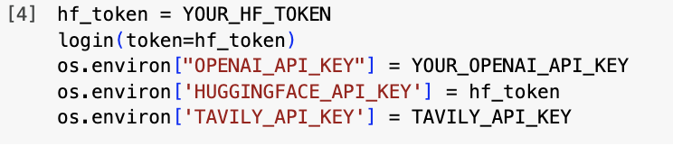

# Financial RAG

## Overview

Financial Intelligence is an advanced Retrieval-Augmented Generation (RAG) project designed to provide intelligent, context-aware financial analysis and insights. By combining cutting-edge language models with sophisticated information retrieval techniques, this project aims to transform how investors and financial professionals access and interpret complex financial data.


## Features

# GenAI Financial Agent

## Overview

The GenAI Financial Agent is a conversational AI system designed to assist users with financial queries. It leverages the powerful **Qwen 2.5** language model, fine-tuned on financial datasets using **LoRA** and **4-bit quantization** for efficient resource utilization. 

To enhance the accuracy and context-awareness of the generated responses, the agent integrates **Retrieval-Augmented Generation (RAG)**. This approach allows the model to access and incorporate relevant information from external knowledge sources during the generation process. 

The agent supports two RAG implementations:

- **Naive RAG:** A straightforward retrieval-based approach where relevant information is retrieved and directly used in the generation process.
- **Agentic RAG:** A more sophisticated approach that enables the model to make informed decisions about which information to retrieve and how to best utilize it for the given task.

**Note:** The current implementation utilizes **Wealth Alpaca** and **Financial QA 10k** as the primary knowledge sources for RAG.

## Features

- **Fine-Tuned Qwen 2.5 Model:**
    - Optimized using **QLoRA** for parameter-efficient training, enabling efficient training and deployment.
    - Trained on a curated dataset of **Wealth Alpaca** to specialize in financial domain knowledge. 
- **Retrieval-Augmented Generation (RAG):**
    - **Naive RAG:** Implements a basic retrieval-based approach for generating responses.
    - **Agentic RAG:** Enables more sophisticated decision-making within the RAG framework for improved performance on complex financial tasks.
    - **Fine-Tuned RAG:** Leverages the fine-tuned Qwen 2.5 model with **Wealth Alpaca** and **Financial QA 10k** as knowledge sources for refined retrieval-based answer generation.
- **Interactive Inference:**
    - Enables real-time question-answering using the fine-tuned model, providing users with immediate responses to their financial inquiries. 

## Getting Started

### Evaluating RAG and Agentic RAG on a Financial Q&A Dataset Compared to Baseline Qwen-2.5 3B

You can import the code to your IDE using:

```bash
git clone https://github.com/SamiraHajizadeh/Financial_RAG.git
cd Financial_RAG
pip install -r requirements.txt
```

Afterwards, change Cell 4 in the notebook before running the code.



## Future Work

- Explore advanced RAG techniques, such as dense retrieval and cross-encoders.
- Integrate with external financial data sources (e.g., APIs, news feeds).
- Develop a user interface for seamless interaction with the agent.
- Implement risk management and safety measures to ensure responsible AI usage in the financial domain.

This README provides a high-level overview of the GenAI Financial Agent. For more detailed information, please refer to the project documentation and code.

**Note:** This README is under development and will be updated with more specific details and instructions in the future.

I hope this enhanced README file is more informative and helpful!
